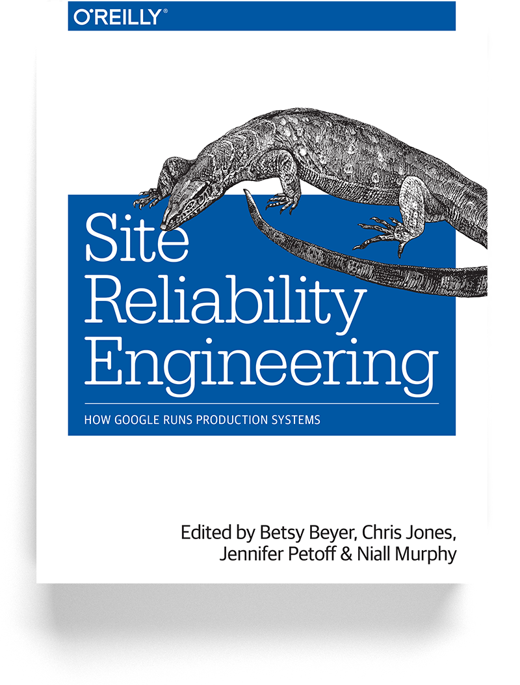

# Site Reliability Engineering

Members of the SRE team explain how their engagement with the entire software lifecycle has enabled Google to build, deploy, monitor, and maintain some of the largest software systems in the world.

## READ ONLINE FOR FREE

https://landing.google.com/sre/sre-book/toc/index.html

## DOWNLOAD EPUB/MOBI/PDF

You can download all files on this repository

## UP TO DATE

Ebooks is generated at `2019-01-08`